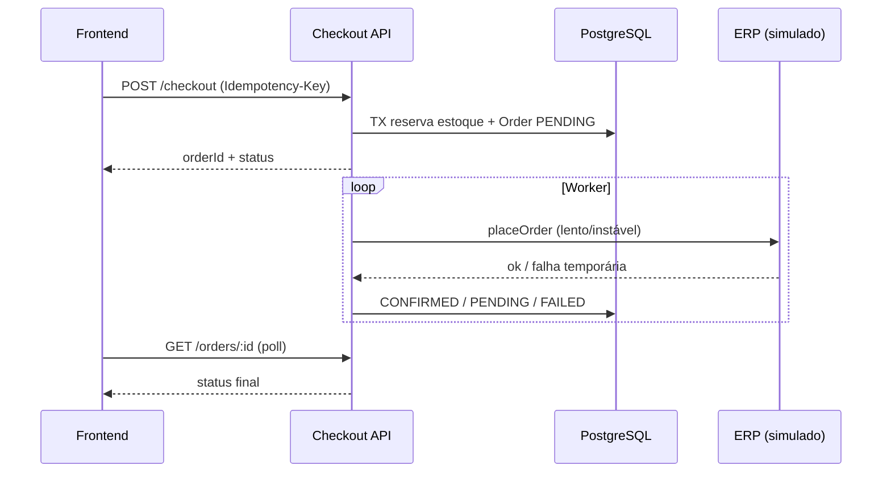

# CaseCellShop — Mini Checkout Fullstack

Mini fluxo de checkout para venda de capinhas, com proteção de estoque, idempotência e processamento assíncrono de pedidos enquanto um ERP simulado permanece lento e instável.

> This is a challenge by [Coodesh](https://coodesh.com/)

## Stack

| Camada | Tecnologias |
|--------|-------------|
| Frontend | Next.js 16, React 19, TypeScript, Tailwind CSS 4, TanStack Query |
| Backend | NestJS 11, Prisma 6, TypeScript |
| Banco | PostgreSQL 17 |
| Infra local | Docker Compose |

A stack segue a preferência do desafio (Next.js + NestJS + Prisma). O banco escolhido é **PostgreSQL** (via Docker) para validar concorrência e transações de forma realista.

## Como rodar (Docker — recomendado)

Pré-requisitos: **Docker** e **Docker Compose**.

```bash
docker compose up --build -d
```

| Serviço | URL |
|---------|-----|
| Frontend | http://localhost:3001 |
| API | http://localhost:3000 |
| Healthcheck API | http://localhost:3000/health |
| PostgreSQL | `localhost:5432` (user/db/password: `casecellshop`) |

Verificar saúde dos containers:

```bash
docker compose ps
```

Parar:

```bash
docker compose down
```

### Desenvolvimento com hot reload

```bash
docker compose -f docker-compose.dev.yml up --build
```

## Como rodar (local, sem Docker na API/Web)

1. Subir apenas o Postgres:

```bash
docker compose up -d postgres
```

2. API:

```bash
cd apps/api
cp .env.example .env
npm install
npm run prisma:generate
npx prisma db push
npm run prisma:seed
npm run start:dev
```

3. Web:

```bash
cd apps/web
cp .env.example .env
npm install
npm run dev
```

Frontend em http://localhost:3000 (dev) ou conforme porta exibida no terminal.

## API (resumo)

| Método | Rota | Descrição |
|--------|------|-----------|
| `GET` | `/health` | Healthcheck |
| `GET` | `/products` | Lista produtos e estoque |
| `GET` | `/products/:id` | Detalhe do produto |
| `POST` | `/checkout` | Cria tentativa de compra (header `Idempotency-Key` opcional; gerado se ausente) |
| `GET` | `/orders/:id` | Status do pedido (requer `Idempotency-Key` correspondente) |

Códigos de erro padronizados: `VALIDATION_ERROR`, `INSUFFICIENT_STOCK`, `ERP_TEMPORARY`, `TECHNICAL_FAILURE`, `NOT_FOUND`.

## Decisões técnicas

- **Estoque**: reserva transacional com `updateMany` condicional (`available >= quantity`) para evitar oversell.
- **Idempotência**: `idempotencyKey` única em `Order`; o backend gera UUID se o cliente não enviar; o frontend persiste a chave por payload (produto + quantidade) para retry seguro.
- **ERP**: `ErpClient` simula latência e falhas temporárias; worker interno (polling) processa pedidos `PENDING` sem Redis na primeira versão.
- **Observabilidade**: `x-request-id` em todas as requisições e logs estruturados no worker.
- **Segurança**: rate limit (Throttler), Helmet, CORS restrito a localhost, `GET /orders/:id` exige a mesma chave de idempotência do pedido.

Detalhes adicionais em [`.cursor/DECISIONS.md`](.cursor/DECISIONS.md).

## Limitações

- Sem autenticação real, pagamento ou integração com ERP de produção.
- Schema sincronizado com `prisma db push` (sem migrations versionadas no repositório).
- Mensageria real (Redis/BullMQ) deixada como evolução futura.
- Testes e2e HTTP completos dependem de Postgres; a suíte principal usa mocks unitários.

## Próximos passos

- Migrations Prisma versionadas e pipeline CI.
- Fila real (BullMQ) substituindo o worker por polling.
- Testes e2e de API com Postgres em container efêmero.
- Cache de catálogo para reduzir carga no “ERP”.

## Testes e verificação

Descrições dos testes em **inglês** (padrão do projeto).

```bash
cd apps/api
npm test              # unit tests (business rules, ERP, checkout)
npm run test:cov      # coverage em regras críticas
```

Principais cenários cobertos:

- `should return same order for same idempotency key`
- `should throw INSUFFICIENT_STOCK when inventory is not enough`
- `should not oversell under concurrent checkouts` (reserva atômica)
- ERP temporary failure e retry via worker

```bash
cd apps/web
npm run build
npm run lint
```

## Arquitetura (visão geral)



## Estrutura do repositório

```
apps/
  api/     # NestJS + Prisma
  web/     # Next.js
docker-compose.yml
docker-compose.dev.yml
.cursor/DECISIONS.md
PROMPTS.md
```
